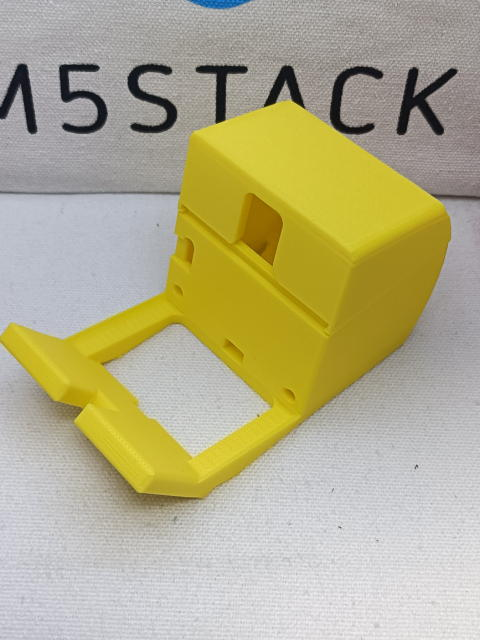
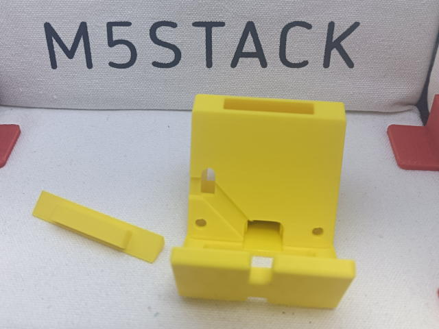

# Stank-chan document

ｽﾀｯｸﾁｬﾝ を模したスタンドです。

# 組み立て方

## ModuleLLM版
「スタックサイズ31mmまで」と「足がフラットなバージョン」がありますが、組み立て方は同一です。

ModuleLLMをスタックし、デバッグボードを固定することができるバージョンです。

[組み立て方](./README_llm.md)

## スタックサイズ26mmまで版

収納は小さいですが、M5Stackを飾るのに丁度よいバージョンです。

[組み立て方](./README_small.md)

