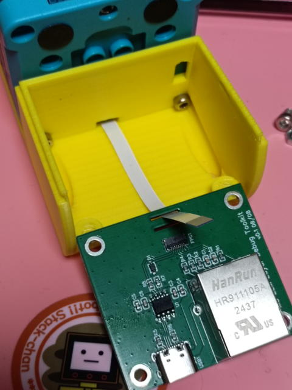
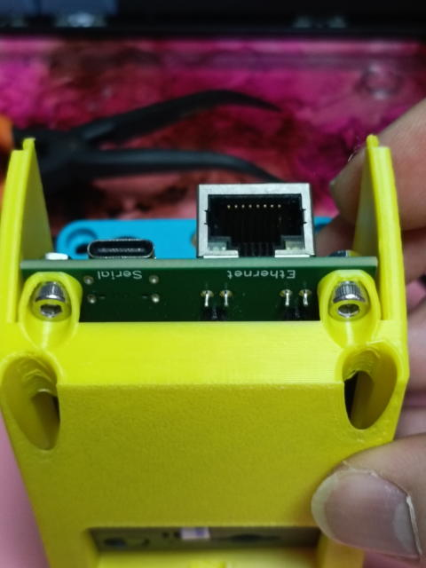
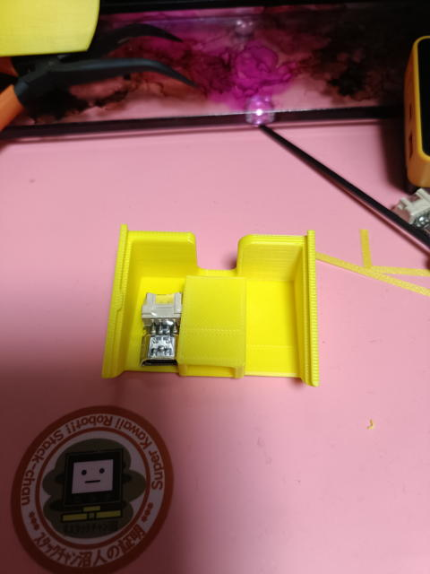
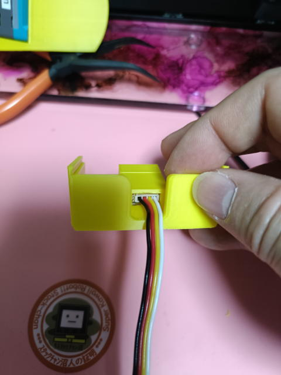

# ModuleLLM Versionの組み立て方

コンパクトに収めるために、組み立ての順番を間違えるとやり直しになる場合があります。 十分注意してください。

# 用意するもの
- ModuleLLM用デバッグボード固定用
  - M3 x 5mm 2pcs
  - M3 ナット 2pcs

- 後ろからPort.A経由で給電したい場合に使用（必須ではありません。）
  - Grove to USB-C コネクタ 1pcs
  - Grove 10cm ケーブル

- Coreを固定するM3ボルト 長さの目安はスタックサイズ+1～2mmです。
 <strong>長すぎると画面のパネルを傷つけます。最初はゆっくり回して、画面が浮かないかどうか確認してください。</strong>

# 手順

1. ModuleLLMにFFC/FPCケーブルを付ける。
 ModuleLLMのスピーカーを剥がすと、FFCコネクタが現れます。そこにケーブルを取り付けて固定します。
 <image src="./images/25.jpg">

2. M5Stackを組み立てる。
 M5StackにModuleLLMやBottomを取り付けます。
 <image src="./images/32.jpg">

3. スタンド下部の部品に、FFCケーブルを通し、Groveケーブルがある場合はあらかじめ通しておきます。
 <image src="./images/29.jpg"><image src="./images/23.jpg">

4. M5Stackを固定する。
 M5Stackを固定します。写真の組み合わせ（CoreS3+ModuleLLM+CoreS3Bottom）の場合はM3x32mmです。
<vr><image src="./images/33.jpg"><image src="./images/34.jpg">

5. FFCケーブルをデバッグボードに固定します。
 スリットを通しても良いですし通さなくても大丈夫だと思います。
 

6. デバッグボードの固定
 M3ナットとM3x5mmボルトで基板を2箇所固定します。Ethernetコネクタ側は狭いので無理せず、片方だけでも十分固定できます。コツはナットを指で支えておいてボルトをねじ込む感じです。
 

7. Grove2USB-Cコネクタの取り付け
 スタンドの上部部品のスペースに横から挿入します。
 

8. GroveケーブルをGrove2USB-Cコネクタに取り付ける。
 少しコツが要りますが、基板を固定してGroveケーブルを深く差し込みます。
 

9. 上部パーツをスライドさせて完成です。

## 完了

これで完成です。