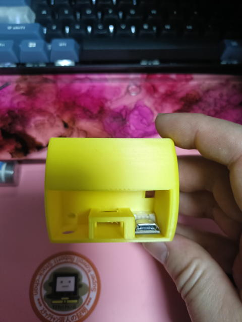
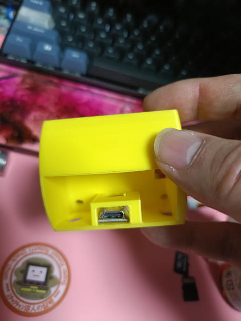
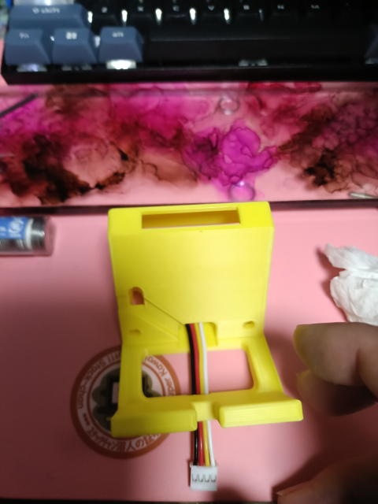
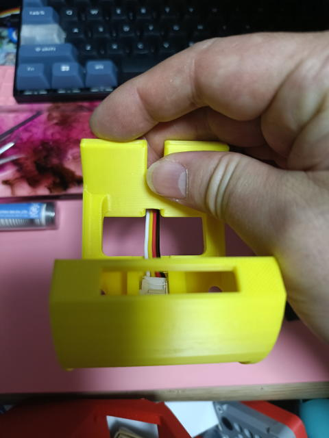
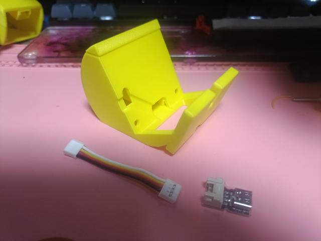

# M5Stack スタンド 26mmバージョンのの組み立て方

# 手順

1. Grove2USB-Cコネクタの取り付け
 後ろ側から見て、右側にUSB-Cコネクタを手前側にして置きます。
 

2. Grove2USB-Cコネクタを横にずらす。
 そのまま横にずらすとぴったり入るように設計しています。
 

2. GroveケーブルをGrove2USB-Cコネクタに取り付ける。
 少しコツが要りますが、基板を指で固定して、Groveケーブルを深く差し込みます。
 

3. 上部部品を取り付ける。
 嵌め合いは、少しきつくしてあるのでもし入らないようであれば、ヤスリで削ってください。
 
## 完了

これで完成です。